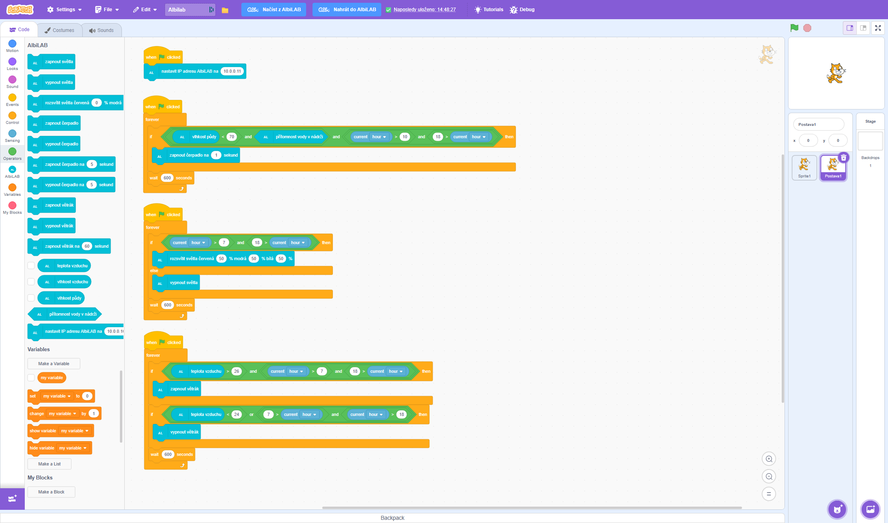

# Scratch Editor AlbiLAB

**Programujte svou AlbiLAB vědeckou stanici pomocí Scratch!** 🧪🔬

Tento projekt rozšiřuje inovativní [AlbiLAB vědeckou stanici](https://www.albilab.cz) o možnosti programování přes Scratch. AlbiLAB je modulární vzdělávací sada, která kombinuje elektroniku, stavební kostky a laboratorní vybavení pro vytvoření kompletní vědecké pracovní stanice pro děti a rodiny.

## Co je AlbiLAB?

AlbiLAB je inovativní vědecká stanice, která obsahuje:
- **Elektroniku**: Řídící deska, LED kroužky, barevný displej, vodiče, powerbanka, adaptér, USB kabel
- **Stavebnici**: Magnetické kostky, kryty a redukce pro vnitřní vybavení, pokovené pásky, řezáček
- **Laboratoř**: Zkumavky, střička, kádinka, pipeta, lupa, Petriho misky, pinzeta, pH papírky
- **Pěstování**: Pěstební nádoby a substrát, keramzit, semínka Huseníčku rolního, vědecký deník

## Co tento projekt přidává?

Projekt Scratch Editor AlbiLAB vám umožňuje:
- **Programovat svou AlbiLAB stanici** pomocí známého vizuálního programovacího jazyka Scratch
- **Ovládat experimenty** a vědecká měření pomocí kódu
- **Vytvářet interaktivní projekty**, které reagují na senzory a ovládají výstupy
- **Ukládat a načítat projekty** přímo do/z vaší AlbiLAB stanice
- **Učit se programování** při provádění skutečných vědeckých experimentů

Perfektní pro děti, rodiče a pedagogy, kteří chtějí spojit praktickou vědu s výukou programování!

<a href="docs/albilab-scratch.png" target="_blank">
  
</a>
*Screenshot rozhraní Scratch Editor AlbiLAB s modifikovaným menu a tlačítky pro integraci s AlbiLAB (klikněte pro plné rozlišení)*

## Vyžaduje trvalý provoz

**Toto řešení musí běžet trvale**, protože vytvořené Scratch programy běží na této backend službě a ovládají AlbiLAB stanici přes její API. Jakmile nahrajete projekt, běží na tomto backendu a komunikuje s AlbiLAB stanicí pro vykonávání naprogramované logiky.

## Showroom režim

Pro veřejný showroom nebo kiosk, kde mají děti pouštět projekty jen přímo ze Scratch GUI, vypněte běh projektů na pozadí pomocí:

```bash
DISABLE_BACKGROUND_PROJECTS=true
```

Když je režim zapnutý, backend vyčistí a odmítá background/nasazené projekty a frontend schová raketku, deploy tlačítka a správu nasazených projektů. Běžná zelená vlajka ve Scratch editoru zůstává funkční.

**Zapnutí showroom režimu:**

```bash
DISABLE_BACKGROUND_PROJECTS=true docker-compose up -d --force-recreate
# nebo
DISABLE_BACKGROUND_PROJECTS=true podman-compose up -d --force-recreate
```

**Vypnutí showroom režimu:**

```bash
DISABLE_BACKGROUND_PROJECTS=false docker-compose up -d --force-recreate
# nebo
DISABLE_BACKGROUND_PROJECTS=false podman-compose up -d --force-recreate
```

Aktuální stav lze ověřit přes:

```bash
curl http://localhost:3001/api/status
```

Odpověď obsahuje položku `backgroundProjectsDisabled`.


## 🚀 Rychlý start

### Předpoklady

- **Docker** nebo **Podman** nainstalovaný v systému
- **Docker Compose** nebo **Podman Compose** nainstalovaný
- Minimálně 2GB volného místa na disku
- Porty 8601 a 3001 dostupné v systému

### Spuštění

1. **Naklonujte repository:**
   ```bash
   git clone <repository-url>
   cd scratch-editor-albilab
   ```

2. **Spusťte aplikaci:**
   
   **S Docker Compose:**
   ```bash
   docker-compose up --build
   ```
   
   **S Podman Compose:**
   ```bash
   podman-compose up --build
   ```

3. **Otevřete aplikaci v prohlížeči:**
   - Scratch Editor: http://localhost:8601
   - Backend API: http://localhost:3001

## 📋 Funkce

### Základní funkce
- **Scratch Editor**: Plnohodnotný webový editor Scratch projektů
- **AlbiLAB integrace**: Přímé připojení k vaší AlbiLAB vědecké stanici
- **Ukládání projektů**: Projekty se automaticky ukládají do AlbiLAB stanice
- **Načítání projektů**: Možnost načíst dříve uložené projekty z AlbiLAB
- **Průběžné ukládání**: Automatické ukládání změn každých 30 sekund
- **Real-time ovládání**: Ovládání AlbiLAB experimentů pomocí Scratch kódu

### AlbiLAB specifické funkce
- **Integrace senzorů**: Čtení dat z AlbiLAB senzorů (teplota, světlo, pH, atd.)
- **Ovládání výstupů**: Ovládání LED kroužků, displejů a dalších AlbiLAB komponent
- **Automatizace experimentů**: Automatizace vědeckých experimentů a sběru dat
- **Záznam dat**: Zaznamenávání a analýza experimentálních dat v čase
- **Konfigurace IP**: Nastavení IP adresy AlbiLAB zařízení pomocí Scratch bloků
- **Validace**: Automatická kontrola povinné IP konfigurační komponenty

### Modifikované menu
- **Skryté tlačítka**: Share/Shared, Remix, See Project Page
- **Skryté sekce**: My Stuff, Scratch Cat
- **Nové tlačítka**:
  - "Nahrát do AlbiLAB" - nahrání a spuštění projektu na vaší stanici
  - "Načíst z AlbiLAB" - načtení uloženého projektu z vaší stanice
  - Indikátor průběžného ukládání

## 🏗️ Architektura

### Služby

1. **scratch-gui** (Port 8601)
   - React frontend aplikace
   - Scratch editor interface
   - WebSocket připojení k backendu

2. **scratch-backend-app** (Port 3001)
   - Node.js/Express backend server
   - REST API pro správu projektů
   - WebSocket server pro real-time komunikaci
   - Automatické spouštění uložených projektů

### Datové svazky (Volumes)

- **./uploads**: Trvalé uložení projektů a konfigurace (bind mount)
  - `saved-project.json` - aktuálně uložený projekt
  - `uploads/` - složka pro nahrávané soubory

## 🔧 Konfigurace

### Nastavení IP adresy AlbiLAB

**DŮLEŽITÉ**: IP adresa AlbiLAB zařízení se nastavuje **pouze** pomocí Scratch bloku "nastavit IP adresu AlbiLAB na [IP]" v každém projektu. Tato komponenta je **povinná** pro jakýkoliv projekt používající AlbiLAB funkce.

### Environment proměnné

**scratch-gui:**
```yaml
REACT_APP_BACKEND_URL: http://localhost:3001
REACT_APP_DISABLE_BACKGROUND_PROJECTS: false
PORT: 8601
```

**scratch-backend-app:**
```yaml
DISABLE_BACKGROUND_PROJECTS: false
PORT: 3001
WEBSOCKET_PORT: 3002
```

### Runtime konfigurace backend URL

Frontend lze nakonfigurovat, aby volal backend na jiné adrese (např. za reverzní proxy) pomocí environment proměnných v `docker-compose.yml`. To je užitečné při provozu systému za reverzní proxy.

**Konfigurace v docker-compose.yml:**

```yaml
services:
  scratch-gui:
    environment:
      - NODE_ENV=production
      - APP_MODE=frontend
      - PORT=8601
      # Runtime konfigurace backend URL (volitelné)
      # Pokud není nastaveno, použije se default localhost:3001
      - REACT_APP_API_BASE_URL=http://10.0.0.106:8080
      - REACT_APP_WS_BASE_URL=ws://10.0.0.106:8080
```

**Příklady:**

1. **Přímé připojení k backendu:**
   ```yaml
   - REACT_APP_API_BASE_URL=http://10.0.0.106:8080
   - REACT_APP_WS_BASE_URL=ws://10.0.0.106:8080
   ```

2. **Reverzní proxy s /api prefixem:**
   ```yaml
   - REACT_APP_API_BASE_URL=http://reverse-proxy.example.com/api
   - REACT_APP_WS_BASE_URL=wss://reverse-proxy.example.com/api
   ```

3. **HTTPS/WSS:**
   ```yaml
   - REACT_APP_API_BASE_URL=https://example.com
   - REACT_APP_WS_BASE_URL=wss://example.com
   ```

**Poznámka:** Frontend automaticky přidává prefix `/api` k endpointům, takže pokud váš backend očekává cesty jako `/api/status`, použijte base URL bez `/api`. Pokud vaše reverzní proxy už obsahuje `/api` v URL, přidejte ho do base URL.

### Porty

- **8601**: Frontend aplikace (Scratch Editor)
- **3001**: Backend API
- **3002**: WebSocket server (interní komunikace)

## 📡 API Endpoints

### Projekty
- `POST /api/start-service-json` - Spuštění nového projektu (JSON data)
- `POST /api/start-service` - Spuštění nového projektu (nahrání souboru)
- `POST /api/stop-service` - Zastavení běžícího projektu
- `GET /api/status` - Stav služby
- `GET /api/logs` - Logy služby

### Uložené projekty
- `GET /api/saved-project` - Informace o uloženém projektu
- `GET /api/saved-project/load` - Načtení dat projektu
- `POST /api/saved-project/auto-save` - Automatické uložení
- `DELETE /api/saved-project` - Smazání uloženého projektu

## 🛠️ Vývoj

### Lokální vývoj

1. **Nainstalujte závislosti:**
   ```bash
   # Frontend
   cd packages/scratch-gui
   npm install
   
   # Backend
   cd packages/scratch-backend
   npm install
   ```

2. **Spusťte v development módu:**
   ```bash
   # Frontend (port 8601)
   cd packages/scratch-gui
   npm start
   
   # Backend (port 3001)
   cd packages/scratch-backend
   npm run dev
   ```

### Rebuild kontejnerů

```bash
# Docker Compose
docker-compose down
docker-compose up --build

# Podman Compose
podman-compose down
podman-compose up --build
```

## 📁 Struktura projektu

```
scratch-editor-albilab/
├── packages/
│   ├── scratch-gui/                 # Frontend aplikace
│   │   ├── src/
│   │   │   ├── components/
│   │   │   │   └── menu-bar/        # Modifikované menu komponenty
│   │   │   ├── containers/          # Redux kontejnery
│   │   │   └── lib/                 # Utility funkce
│   │   └── Dockerfile
│   └── scratch-backend/             # Backend aplikace
│       ├── src/
│       │   ├── server.js            # Hlavní server
│       │   └── startup.js           # Startup skripty
│       └── Dockerfile.universal
├── docker-compose.yml               # Orchestrace služeb
└── README.md
```

## 🔍 Troubleshooting

### Časté problémy

1. **Porty jsou obsazené:**
   ```bash
   # Zkontrolujte obsazené porty
   netstat -tulpn | grep :8601
   netstat -tulpn | grep :3001
   
   # Zastavte konflikující služby nebo změňte porty v docker-compose.yml
   ```

2. **Kontejnery se nespustí:**
   ```bash
   # Zkontrolujte logy
   docker-compose logs
   # nebo
   podman-compose logs
   
   # Zkuste rebuild
   docker-compose up --build --force-recreate
   ```

3. **Projekty se neukládají:**
   ```bash
   # Zkontrolujte volume mounty
   docker volume ls
   
   # Zkontrolujte oprávnění složky uploads
   ls -la uploads/
   ```

4. **WebSocket připojení selhává:**
   - Zkontrolujte, že backend běží na portu 3001
   - Ověřte firewall nastavení
   - Zkontrolujte logy backendu pro chyby

5. **Problémy s komunikací AlbiLAB:**
   - Zkontrolujte, že projekt obsahuje blok "nastavit IP adresu AlbiLAB na [IP]" s vyplněnou IP adresou
   - Zkontrolujte síťové připojení k AlbiLAB zařízení
   - Ověřte, že IP adresa v bloku je správná

### Logy

```bash
# Všechny služby
docker-compose logs -f

# Konkrétní služba
docker-compose logs -f scratch-gui
docker-compose logs -f scratch-backend-app

# Posledních 50 řádků
docker-compose logs --tail=50
```

## 🔄 Aktualizace

### Aktualizace kódu

1. **Zastavte služby:**
   ```bash
   docker-compose down
   ```

2. **Aktualizujte kód:**
   ```bash
   git pull origin main
   ```

3. **Restartujte s rebuild:**
   ```bash
   docker-compose up --build
   ```

### Zálohování dat

```bash
# Zálohování uploads složky
tar czf uploads-backup.tar.gz -C ./uploads .

# Obnovení zálohy
tar xzf uploads-backup.tar.gz -C ./uploads
```

## 🍓 ARM procesory (Raspberry Pi)

### 🚀 Jednopříkazová instalace

Pro Raspberry Pi OS Lite můžete nainstalovat vše jedním příkazem:

```bash
curl -sSL https://raw.githubusercontent.com/nickelsound/scratch-editor-albilab/refs/heads/main/install.sh | bash
```

**Nebo manuálně:**
```bash
wget https://raw.githubusercontent.com/nickelsound/scratch-editor-albilab/refs/heads/main/install.sh
chmod +x install.sh
./install.sh
```

Instalační skript provede:
- ✅ Kontrolu kompatibility systému (Raspberry Pi OS, ARM64)
- ✅ Instalaci Podman a podman-compose
- ✅ Stažení universal ARM64 kontejneru z GitHub releases
- ✅ Načtení kontejneru do Podman
- ✅ Vytvoření systemd služby pro automatický start
- ✅ Spuštění aplikace na pozadí
- ✅ Zobrazení IP adresy pro síťový přístup

Po instalaci přistupte k aplikaci na `http://[RASPBERRY_PI_IP]:8601`

### Manuální instalace

Pokud preferujete manuální instalaci nebo potřebujete sestavit kontejnery sami:

#### Předpoklady pro ARM build

- **Podman** nainstalovaný v systému
- **Docker Compose** nebo **Podman Compose**
- Minimálně 4GB RAM pro build proces
- Dostatek místa na disku (build může vyžadovat 10GB+)

#### Sestavení ARM verzí

1. **Spusťte Universal ARM build script:**
   ```bash
   chmod +x build-arm-universal.sh
   ./build-arm-universal.sh
   ```

2. **Výsledek:**
   - `scratch-universal-arm64.tar` - Universal kontejner pro ARM64 (obsahuje frontend i backend)
   - Pokud je soubor větší než 1.8GB, bude rozdělen na části: `scratch-universal-arm64.tar.00`, `scratch-universal-arm64.tar.01`, atd.

#### Manuální nasazení na Raspberry Pi

1. **Přeneste tar archiv na Raspberry Pi:**
   
   Pokud byl soubor rozdělen na části, nejdříve ho sestavte:
   ```bash
   cat scratch-universal-arm64.tar.* > scratch-universal-arm64.tar
   ```
   
   Poté přeneste na Raspberry Pi:
   ```bash
   scp scratch-universal-arm64.tar pi@raspberry-pi-ip:~/
   ```

2. **Na Raspberry Pi načtěte image:**
   ```bash
   podman load -i scratch-universal-arm64.tar
   
   # Přetagujte podle docker-compose.yml
   podman tag scratch-universal:latest scratch-universal:latest
   ```

3. **Vytvořte docker-compose.yml a spusťte aplikaci:**
   ```bash
   # Vytvořte docker-compose.yml (viz install.sh pro referenci)
   # Nebo použijte ten vytvořený install.sh
   podman-compose up -d
   ```

#### ARM specifické konfigurace

**Porty pro ARM verzi:**
- **8601**: Frontend aplikace
- **3001**: Backend API
- **3002**: WebSocket server

**Environment proměnné pro ARM:**
```yaml
# scratch-gui (ARM)
REACT_APP_BACKEND_URL: http://localhost:3001
PORT: 8601

# scratch-backend-app (ARM)
PORT: 3001
WEBSOCKET_PORT: 3002
```

#### Troubleshooting ARM build

1. **Build selhává kvůli paměti:**
   ```bash
   # Zvyšte swap
   sudo fallocate -l 2G /swapfile
   sudo chmod 600 /swapfile
   sudo mkswap /swapfile
   sudo swapon /swapfile
   ```

2. **NPM timeout chyby:**
   ```bash
   # Zvyšte timeout před buildem
   npm config set fetch-timeout 300000
   npm config set fetch-retry-mintimeout 20000
   ```

3. **Podman build chyby:**
   ```bash
   # Vyčistěte cache
   podman system prune -a -f
   npm cache clean --force
   ```

#### Kompletní Raspberry Pi setup

Pro kompletní nastavení na Raspberry Pi s dotykovým displejem viz [README-RPI.md](README-RPI.md).

#### Správa služby

Po instalaci můžete spravovat službu pomocí:

```bash
# Zkontrolovat stav služby
sudo systemctl status scratch-albilab

# Zastavit službu
sudo systemctl stop scratch-albilab

# Spustit službu
sudo systemctl start scratch-albilab

# Restart služby
sudo systemctl restart scratch-albilab

# Zobrazit logy
cd /opt/scratch-albilab
podman-compose logs -f
```

Pro podrobné instalační instrukce viz [README-INSTALL.md](README-INSTALL.md).

## 🤝 Podpora

Pro technickou podporu nebo hlášení problémů:
- Vytvořte issue v repository
- Kontaktujte vývojový tým AlbiLAB

## 📄 Licence

Tento projekt je licencován pod [MIT License](LICENSE).

---

**Poznámka**: Tento projekt je modifikací oficiálního Scratch editoru speciálně navrženou pro umožnění programování AlbiLAB vědeckých stanic. Spojuje vizuální programovací vzdělávání s praktickými vědeckými experimenty, což je ideální pro děti, rodiny a pedagogy, kteří chtějí spojit programování se skutečnou vědou.
